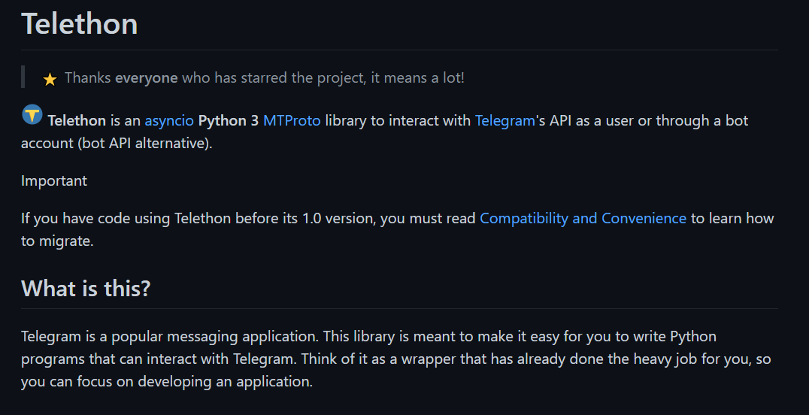

# Python telegram bot ： telethon 導入 -day11

## telethon 導入

    from telethon import TelegramClient
    api_id = input("輸入你的api id")
    api_hash = input("輸入你的api hash")
    client = TelegramClient('server', api_id, api_hash)
    tcli = client.start("2087437708:AAEs__S7iQVNVtr9GudmKV7osYdDGsTyay0")