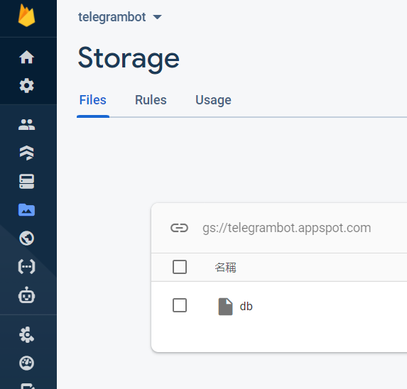

# Python telegram bot ： Firebase Storage 使用 -day14

## Firebase Storage 使用 

`pip install pyrebase`

	config = {
		#打入firebase給予的config
	}

	try:
		import pyrebase
	except:
		import pyrebase

	firebase = pyrebase.initialize_app(config)
	storage = firebase.storage()
	storage.child("db").put("db")

這樣就完成儲存 db 這個檔案到firebase上的程序