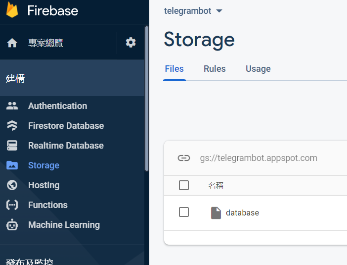

# Python telegram bot ： 將資料加入存儲 -day15

## 將資料加入存儲

storage.py:

	config = {
		#打入firebase給予的config
	}

	try:
		import pyrebase
	except:
		import pyrebase

	firebase = pyrebase.initialize_app(config)
	storage = firebase.storage()

	def saveData():
		storage.child("database").put("database")