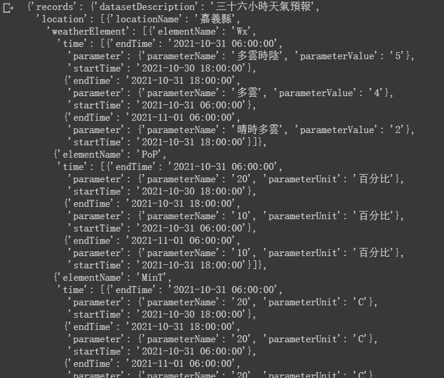

# Python telegram bot ： 爬蟲今日天氣 -day19

## 爬蟲今日天氣

	import requests as rqs
	import bs4 as bs
	import json
	res = rqs.get("https://data.gov.tw/dataset/6069")
	dta = list(filter(lambda x:x.text.find("https://opendata.cwb.gov.tw/api/v1/rest/datastore/") != -1,bs.BeautifulSoup(res.content).find_all("script")))[0].text
	dta = dta[dta.find("https://opendata.cwb.gov.tw/api/v1/rest/datastore/"):]
	dta = dta[:dta.find("\"")]
	data = json.loads(rqs.get(dta).content)