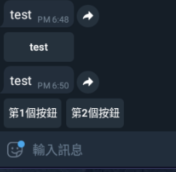

# Python telegram bot ： 使用telegram api送含有按鈕之訊息 -day23

## 使用telegram api送含有按鈕之訊息

	
	import telepot
	bot = telepot.Bot("2087437708:AAEs__S7iQVNVtr9GudmKV7osYdDGsTyay0")
	userId = input("輸入你的id")
	bot.sendMessage(userId,"test",reply_markup=
		{'inline_keyboard': [
		[{'callback_data': "test",'text': "test"}]
	]})

	bot.sendMessage(userId,"test",reply_markup=
		{'inline_keyboard': [
		[{'callback_data': "test",'text': "第1個按鈕"},
		{'callback_data': "test",'text': "第2個按鈕"}]
	]})
