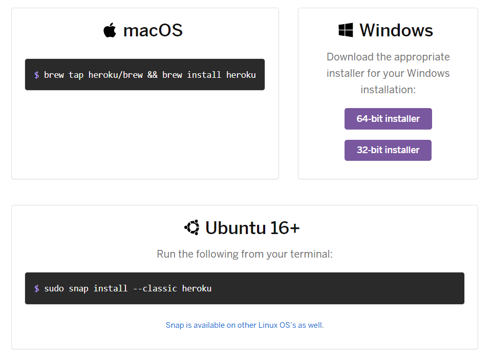

# Python telegram bot ：  heroku部署 -day28

## heroku部署

Heroku設定
前往 https://heroku.com 建立帳號

接下來要新增app
點擊右上角New，選擇Create new app

下載Heroku cli
前往 https://devcenter.heroku.com/articles/heroku-cli 下載
依據自己的系統環境選擇對應的下載檔案

確認安裝完成後，接下來要登入
先移動到專案資料夾後輸入以下命令

`heroku login`

接著輸入
`git add .`
`git commit -m "你這次的更新內容"`
`git push -u heroku master`
即部屬完成