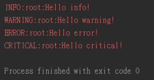

# Python telegram bot ：  log與debug -day29

## log與debug

logging 為開發者提供了 5 種程度不同的描述來紀錄訊息，分別是 debug、info、waring、error、critical，這五種的嚴重比較程度，如下：
`DEBUG < INFO < WARNING < ERROR / EXCEPTION < CRITICAL`

	import logging
	 
	logging.debug('Hello debug!')
	logging.info('Hello info!')
	logging.warning('Hello warning!')
	logging.error('Hello error!')
	logging.critical('Hello critical!')

