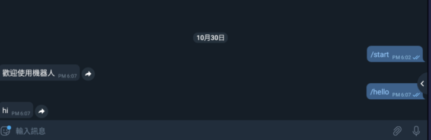

# Python telegram bot ： 接受基本指令回饋 -day4

## 接受基本指令回饋

    import time,telepot
    bot = telepot.Bot("2087437708:AAEs__S7iQVNVtr9GudmKV7osYdDGsTyay0")
    offset = None
    while 1:
      try:
        updates = bot.getUpdates(offset=offset)
        for i in updates:
          offset = i['update_id'] + 1
          if i['message']['text'] == "/start":
            bot.sendMessage(i['message']['from']['id'],"歡迎使用機器人")
          if i['message']['text'] == "/hello":
            bot.sendMessage(i['message']['from']['id'],"hi")
      except:
        break