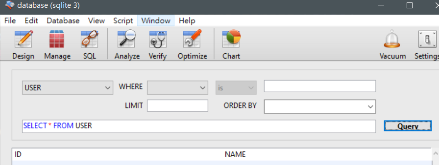

# Python telegram bot ：創建資料表 -day5

## 創建資料表

    import sqlite3
    connect = sqlite3.connect("database", check_same_thread=False)
    cursor = connect.cursor()
    script = """CREATE TABLE USER  (
        ID TEXT,
        NAME TEXT
    )"""
    cursor.execute(script)
	connect.commit()