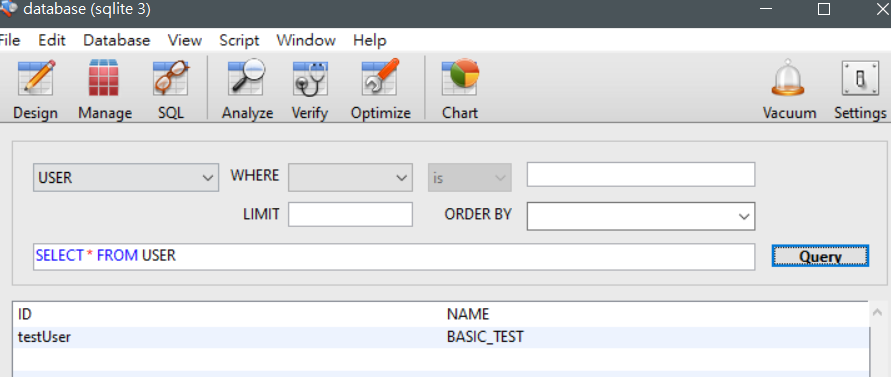

# Python telegram bot ： 創建匯入資料方程式 -day6

## 創建匯入資料方程式

    def addUser(uid,name):
        cursor.execute("INSERT INTO USER (ID,NAME) VALUES (?,?)",uid)
        connect.commit()
    addUser(input("輸入使用者ID"),input("輸入使用者名稱"))