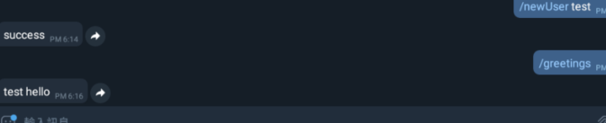
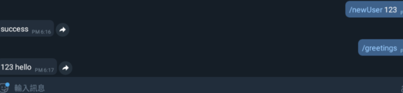

# Python telegram bot ： 根據不同使用者回覆訊息 -day8

## 根據不同使用者回覆訊息

    import time,telepot
    bot = telepot.Bot("2087437708:AAEs__S7iQVNVtr9GudmKV7osYdDGsTyay0")
    offset = None
	while 1:
	  try:
	    updates = bot.getUpdates(offset=offset)
	    for i in updates:
	      offset = i['update_id'] + 1
	      if i['message']['text'] == "/newUser":
	        addUser(i['message']['from']['id'],i['message']['text'].replace("/newUser"))
	        bot.sendMessage(i['message']['from']['id'],"success")
	      if i['message']['text'] == "/greetings":
	           username = getUser(i['message']['from']['id'],"name")
	           bot.sendMessage(i['message']['from']['id'],"%s hello"%username)
	  except:
	    break